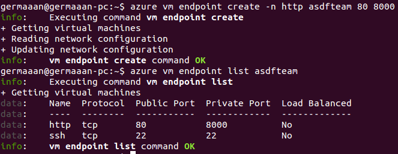

# Práctica 4: Diseño del soporte virtual al desarrollo y despliegue de una aplicación
# ASDF Team:
## José Manuel Castillo Pérez
## Iñaki Fernández Janssens de Varebeke
## Manuel Jesús García Manday
## Germán Martínez Maldonado
## Elisabet Romero Vaquero
## Javier Rubio Giménez
## Pablo Sánchez Robles
## María Victoria Santiago Alcalá
## Juan David Vargas Jiménez

## Publicado bajo licencia GNU GENERAL PUBLIC LICENSE Version 3

### Descripción

Esta práctica consiste en realizar el diseño de una serie de máquinas virtuales que serán usadas para desarrollar una aplicación solicitada que cumpla una necesidad real, en este caso será la realización de una aplicación web para una empresa de traducción que necesita que sus clientes puedan registrarse en la misma y subir archivos con texto en diferentes formatos, que una vez confirmados, sean enviados para que sean traducidos.

Esta aplicación será desarrollada en **Python**, usando el entorno de desarrollo web **Django** y los paquetes **Allauth** para la registro/autentificación de usuarios y **Filebaby** para la gestión de subida/descarga de archivos. Además también usará una base de datos **SQLite3**.

Se va a usar una metodología ágil para el desarrollo de la aplicación, pero también para el despliegue de la misma, con el objetivo de que ambos procesos se puedan llevar a cabo de la manera más rápida posible debido al corto periodo de tiempo disponible en el entorno de coworking (solo un fin de semana), todos los integrantes del grupo deberán estar sincronizados para poder llevar a cabo el trabajo en el tiempo estimado.

El motivo de usar varias máquinas virtuales es que en un entorno real nunca se debería llevar a cabo todo el desarrollo en una misma máquina por los diversos problemas que esto puede ocasionar, y aunque este es un proyecto pequeño (por el limitado tiempo para llevarlo a cabo), deberá contar mínimo con servidores de prueba y servidor de producción. Las pruebas del código que se vaya desarrollando se harán en una máquina local aprovisionada mediante Vagrant y Ansible. Una vez que se tenga una versión finalizada de la aplicación, está será desplegada en el servidor de producción, una máquina virtual en la plataforma Windows Azure que ha sido aprovisionada mediante Ansible, y en la que a través de la dirección [http://asdfteam.cloudapp.net/](http://asdfteam.cloudapp.net/) el cliente podrá ver el resultado final de la aplicación para darle su aprobación final.

### Licencia

La licencia bajo la que publicamos esta aplicación es GNU GPL v3, esto da permiso a cualquier persona u organización para realizar modificaciones sobre la misma, además de poder realizar copias y distribuir tanto la versión original como la modificada, pudiendo cobrar o no por ello, pero siempre permaneciendo el mismo como software libre. 

Las licencias de herramientas a usar [Bootstrap](https://github.com/twbs/bootstrap/blob/master/LICENSE) bajo licencia MIT y [Django](https://github.com/django/django/blob/master/LICENSE) bajo Django Software Foundation, así como los módulos [Allauth](https://github.com/pennersr/django-allauth/blob/master/LICENSE) y [Filebaby](https://bitbucket.org/kelvinwong_ca/kelvinwong_ca_blogcode/src/48da11108f2a7051a164c023829353dfffcd5481/django_filefield_tutorial/uploadering/filebaby/?at=default) bajo licencias propias del desarrollador y contribuidores, son compatibles con la licencia GNU GPL de nuestra aplicación por lo que podemos usarlos con la misma.

### Aprovisionamiento servidor de pruebas

Aunque podríamos tener un único servidor de pruebas donde todos los desarrolladores realizaran las pruebas sobre los cambios hechos en el código, para usar Vagrant vamos a crear una máquina virtual la cual configuraremos usando Vagrant mediante el aprovisionador Ansible. Para ello lo primero es instalar el propio Vagrant, se puede instalar directamente mediante APT como una aplicación típica o como una gema de Ruby, por experiencia, instalarlo como aplicación da menos problemas. Además, Vagrant también depende de VirtualBox, por lo que tendremos que instalarlo también.

```
sudo apt-get install vagrant virtualbox
```

Vamos a trabajar bajo Ubuntu, así que por fiabilidad vamos a basarnos en Ubuntu 12.04.3 LTS (Precise Pangolin) que tiene soporte extendido. Como tenemos poco tiempo y queremos seguir una metodología ágil, vamos a descarganos la imagen de una máquina ya configurada para Vagrant; en nuestro caso elegimos [esta](http://cloud-images.ubuntu.com/vagrant/precise/current/precise-server-cloudimg-amd64-vagrant-disk1.box), una versión oficial de Ubuntu que tiene las actualizaciones al día. Así que la descargamos, dándolo un nombre, y la inicializamos.

```
vagrant box add asdftest http://cloud-images.ubuntu.com/vagrant/precise/current/precise-server-cloudimg-amd64-vagrant-disk1.box
vagrant init asdftest
```


Se habrá creado un el archivo **Vagrantfile** en el directorio actual, este archivo contiene en su interior la configuración que será aplicada a la máquina virtual. Añadimos una línea para indicar que a la máquina virtual que acabamos de crear (**asdftest**) se le asigna una dirección IP (**ip: "192.168.2.50"**) para acceder desde el anfitrión mediante una red privada (**:private_network**). Por ahora esta es toda la modificación que haremos al archivo Vagranfile, ya que en todos los intentos de realizar toda la configuración de una vez, hemos tenido problemas, así que sin más, ahora levantamos la máquina virtual y comprobamos que tenemos acceso SSH a la misma.

* **Vagrantfile**:
```
# -*- mode: ruby -*-
# vi: set ft=ruby :

Vagrant.configure("2") do |config|
  config.vm.box = "asdftest"
  config.vm.network :private_network, ip: "192.168.2.50"
end
```

```
vagrant up
vagrant ssh
```


Para no tener problemas durante la aplicación de la configuración con Ansible, copiamos nuestro archivo de clave pública en la máquina virtual para poder acceder directamente.

```
ssh-copy-id vagrant@192.168.2.50
ssh vagrant@192.168.2.50
```


El último tramo de la creación de esta máquina virtual es provisionarla mediante Ansible. Si no lo tenemos instalado lo podemos instalar fácilmente añadiendo un repositorio y instalándolo con APT.

```
sudo add-apt-repository ppa:rquillo/ansible
sudo apt-get update
sudo apt-get install ansible
```

Ahora tenemos que modificar el archivo **Vagrantfile** para añadirle las líneas que le digan que tiene que aprovisionar la máquina virtual usando Ansible realizando las acciones indicadas en el playbook **test.yml**.

* **Vagrantfile**:
```
# -*- mode: ruby -*-
# vi: set ft=ruby :

Vagrant.configure("2") do |config|
  config.vm.box = "asdftest"
  config.vm.network :private_network, ip: "192.168.2.50"

  config.vm.provision "ansible" do |ansible| 
    ansible.playbook = "test.yml"
  end

end
```

Siendo el playbook **test.ytml** el siguiente:

* **test.yml**:
```
---
- hosts: test
  sudo: yes
  remote_user: vagrant
  tasks:
    - name: Actualizar lista de paquetes de los repositorios
      apt: update_cache=yes
    - name: Instalar Git
      apt: name=git state=present
    - name: Instalar Python
      apt: name=python state=present
    - name: Instalar Wget
      apt: name=wget state=present
    - name: Descargar Django
      command: wget https://www.djangoproject.com/m/releases/1.6/Django-1.6.1.tar.gz 
               creates=/usr/local/lib/python2.7/dist-packages/django
    - name: Descomprimir Django
      command: tar xzf Django-1.6.1.tar.gz
               creates=/usr/local/lib/python2.7/dist-packages/django
    - name: Instalar Django
      command: python Django-1.6.1/setup.py install
               creates=/usr/local/lib/python2.7/dist-packages/django
```

Para instalar los paquetes tenemos que tener permisos de superusuario, por lo que indicamos que vamos a trabajar como superusuario (`sudo: yes`),

Para trabajar con el repositorio GitHub vamos a necesitar `git`, para ejecutar la aplicación vamos a necesitar Python (que se puede instalar directamente mediante APT) y Django (que por problema con la versión en los repositorios, es necesario descargarse manualmente e instalar la última versión disponible). Incluimos también la instalación de Wget, para el supuesto caso de que no se encontrara en el sistema y no pudieramos descargarnos Django con él.

La opción `state=present` de las líneas `apt` indica que el paquete indicado en `name` tiene que estar presente en el sistema, por lo que se instalará en caso contrario.

La opción `creates=/usr/local/lib/python2.7/dist-packages/django`, que tienen varias acciones, indica que si existe la carpeta indicada no realizarán dichas acciones. El motivo es que esa carpeta es en la que se instala Django, así que si esa carpeta existe, significará que Django se encuentra instalado en el sistema, no siendo necesario (ni recomendable) volver a instalar el paquete de instalación y volver a instalarlo.

Para que Ansible pueda provisionar la máquina virtual, necesita un archivo de inventario con la dirección del host a aprovisionar, así que creamos el archivo **ansible_hosts** y e indicamos la dirección del mismo.

* **ansible_host**:
```
[test]
192.168.2.50
```

Comprobamos el contenido de nuestro archivo de inventario, y le asignamos su ruta a la variable **ANSIBLE_HOSTS** para que Ansible sepa donde encontrarlo.

```
cat ansible_hosts
export ANSIBLE_HOSTS=~/ansible_hosts
echo $ANSIBLE_HOSTS
```


Con todo realizado y comprobado, solo nos queda usar Vagrant para provisionar la máquina virtual.

```
vagrant provision
```


Accedemos ahora a la máquina virtual y mediante un pequeño programa en Python que podemos introducir en una misma línea comprobamos que Django se ha instalado corréctamente (comprobando de paso que Python también se ha instalado). El resultado es que se tiene que mostrar por pantalla el directorio donde está instalado Django, siempre y cuando se haya instalado.

```
vagrant ssh
python -c "import sys; sys.path = sys.path[1:]; import django; print(django.__path__)"
```


Una vez que queramos probar los cambios en el código subidos a GitHub, simplemente tenemos que desplegar los códigos fuentes desde la rama en la que estemos trabajando, para el servidor de pruebas trabajamos en la rama **test**. Para la primera prueba deberemos hacerlo con `git clone`. Después de esto podemos ejecutar la aplicación generando los binarios en su interior.

```
git clone -b dev https://github.com/IV-GII/Django_Traduccion.git
python manage.py runserver 0.0.0.0:8000
```


Accediendo desde un navegador a la dirección IP de la máquina virtual (**192.168.2.50**), podemos comprobar el estado de prueba de nuestra aplicación.


### Aprovisionamiento servidor de producción

Una vez que tenemos la aplicación en un estado entregable, vamos a montar la siguiente máquina virtual para desplegar nuestra aplicación en ella y que pueda ser accedida desde fuera de nuestra red interna. Los pasos a llevar a cabo son los típicos, como vamos a usar la infraestructura de Windows Azure, lo primero que debemos seleccionar es la imagen que se va a instalar en dicha máquina virtual. Nuestro desarrollo se ha llevado a cabo en un sistema operativo Ubuntu, así que por compatibilidad buscamos una imagen de la misma versión de Ubuntu que hemos usado en pruebas, 12.04.3 LTS Precise Pangolin, y para evitar problemas de seguridad elegimos la imagen generada diariamente con todas las actualizaciones instaladas.

```
azure vm image list
```


Para comprobar que ciertamente la imagen contiene lo que necesitamos para nuestro servidor de producción, solicitamos la información sobre dicha imagen, es importante que se pueda usar en la localización en la que vamos a situar físicamente nuestra máquina virtual, Europa occidental, y la descripción que confirma que es una versión con las actualizaciones al día, lo que nos interesa.

```
azure vm image show b39f27a8b8c64d52b05eac6a62ebad85__Ubuntu_DAILY_BUILD-precise-12_04_3-LTS-amd64-server-20140127-en-us-30GB
```


Solo nos queda comenzar la creación de la máquina virtual, dándole tanto al nombre del host como al nombre de usuario el nombre de nuestro équipo de desarrollo, **asdfteam**. También tenemos que indicar el nombre de la imagen a instalar (**b39f27a8b8c64d52b05eac6a62ebad85__Ubuntu_DAILY_BUILD-precise-12_04_3-LTS-amd64-server-20140127-en-us-30GB**), una contraseña (**contraseña privada**), la localización de la región en la que situarla físicamente (**--location "West Europe"**) y que se permita la conexión mediante SSH usando el puerto estándar 22 (**--ssh**).

```
azure vm create asdfteam b39f27a8b8c64d52b05eac6a62ebad85__Ubuntu_DAILY_BUILD-precise-12_04_3-LTS-amd64-server-20140127-en-us-30GB asdfteam PASSWORD --location "West Europe" --ssh
```


Cuando finalice la instalación, lo siguiente es arrancarla para comprobar que funciona correctamente.

```
azure vm start asdfteam
```


Para comprobar que tenemos acceso, nos conectamos a la misma mediante SSH indicando el nombre de usuario (**asdfteam**) y la dirección del host (**asdfteam.cloudapp.net**).

```
ssh asdfteam@asdfteam.cloudapp.net
```


Al igual que en nuestro servidor de pruebas, copiamos nuestro archivo de clave pública al servidor de producción para poder acceder a él directamente.

```
ssh-copy-id asdfteam@asdfteam.cloudapp.net
ssh asdfteam@asdfteam.cloudapp.net
```


Llegamos al punto en que vamos a usar Ansible, tenemos que tener ahora además la dirección de nuestro servidor de producción, así que lo añadimos.

* **ansible_host**:
```
[asdfteam]
asdfteam.cloudapp.net
```

Para comprobar que hay conexión con el servidor de producción realizamos un `ping`.

```
ansible asdfteam -u asdfteam -m ping	# Como hemos copiado nuestra clave pública en el servidor, solo tenemos que introducir usuario.
```


Ahora tenemos que crear el playbook que le indique a Ansible las acciones que tiene que llevar a cabo en el servidor remoto, que en este caso serán instalar todas las aplicaciones que puede hacer faltar el despliegue de la aplicación, desplegar los fuentes aplicación y ejecutarla de forma que sea accesible remotamente. Este playbook básicamente es una ampliación de que hemos realizado para el aprovisionamiento de las máquinas de prueba así que solo explicaremos las diferencias significativas.

Como también tenemos que realizar tareas de instalación, indicamos que la acciones se realizarán como un usuario con permisos de administración (`sudo: yes`), y para poder acceder al host, indicamos que accederemos mediante el usuario creado durante la creación de la máquina virtual (`remote_user: asdfteam`).

La aplicación usa una base de datos para la gestión de los registros de los usuarios, así que es necesario que el usuario local tenga permisos de escritura para aplicar los cambios que se produzcan en dicha base de datos, además como no es normal que una aplicación de usuario pertenezca al usuario **root**, cambiamos el propietario de la estructura de directorios y archivos de la aplicación al usuario **asdfteam** (`chown -R asdfteam:asdfteam /home/asdfteam/django_trad`).

La parte final es para la ejecución automática de la aplicación una vez la máquina esté aprovisionada, la forma más simple de ejecutar nuestra aplicación es convirtiéndola en un servicio **Upstart**; así mediante `service` podríamos iniciar, detener o reiniciar nuestro programa sin complicación. Para poder convertir nuestra aplicación en un servicio **Upstart** necesitamos crear un script de funcionamiento upstart, en el que básicamente introduciremos los comportamientos que podremos gestionar del programa como servicio. Este script lo tenemos que indicar con `template`, indicando con `src` la ruta del script en el ordenador desde el que estamos aprovisionando remotamente y con `dest` la ruta a donde se copiará remotamente en el servidor aprovisionado, para que funcione correctamente le asignamos como propietario y grupo `root` con permisos de lectura y escritura para él y solo lectura para grupo y otros.

Ahora simplemente deberíamos indicar con `service` el nombre del servicio (`name=trad`) y que sea reiniciado (`state=restarted`), para que la aplicación arranque y podamos comenzar a utilizarla.

* **asdfteam.yml**:

```
---
---
- hosts: asdfteam
  sudo: yes
  remote_user: asdfteam
  tasks:
    - name: Actualizar lista de paquetes de los repositorios
      apt: update_cache=yes
    - name: Instalar Git
      apt: name=git state=present
    - name: Instalar Python
      apt: name=python state=present
    - name: Instalar Wget
      apt: name=wget state=present
    - name: Descargar Django
      command: wget https://www.djangoproject.com/m/releases/1.6/Django-1.6.1.tar.gz 
               creates=/usr/local/lib/python2.7/dist-packages/django
    - name: Descomprimir Django
      command: tar xzf Django-1.6.1.tar.gz
               creates=/usr/local/lib/python2.7/dist-packages/django
    - name: Instalar Django
      command: python Django-1.6.1/setup.py install
               creates=/usr/local/lib/python2.7/dist-packages/django
    - name: Desplegar fuentes de la aplicación
      git: repo=https://github.com/IV-GII/Django_Traduccion.git
           dest=/home/asdfteam/django_trad
           version=prod
    - name: Cambiar propietario de la carpeta de la aplicacion
      command: chown -R asdfteam:asdfteam /home/asdfteam/django_trad
    - name: Crear servicio upstart
      template: src=trad.conf dest=/etc/init/trad.conf owner=root group=root mode=0644
    - name: Iniciar aplicación
      service: name=trad state=restarted
```

Como apunte, nuestro script upstart básicamente lo que hará primero es detener la ejecución del servicio en todos los niveles de ejecución multiusuarios típicos, hacer respawn ante cualquier posible error que se haya producido, y por último dentro de una sección `script`, introducimos los comandos necesarios para ejecutar la aplicación; en nuestro caso, solo hemos puesto situarnos en el directorio de la aplicación y ejecutar con Python el script de arranque **manage.py** con la opción **runserver** con una dirección **0.0.0.0** (para ser accesible desde el exterior) y un puerto **8000**.

* **trad.conf**:

```
stop on runlevel [!2345]

# Reiniciamos si se para
respawn

script
    cd /home/asdfteam/django_trad
    python manage.py runserver 0.0.0.0:8000
end script
```

Solo tendremos que hacer que Ansible ejecute el libro de jugadas que acabamos de describir.

```
ansible-playbook asdfteam.yml
```


Para poder probar la aplicación, primero necesitamos añadir un extremo a la máquina virtual que nos permita conectarnos a ella. Como vamos a acceder vía web, añadimos un extremo HTTP que mediante el protocolo TCP, conecte nuestro puerto privado 8000 (puerto del que está escuchando nuestra aplicación) con un puerto público 80 (puerto al que mandará la respuesta de la aplicación y del que escucharán los navegadores por defecto). Comprobamos también que dicho extremo se ha creado correctamente.

```
azure vm endpoint create -n http asdfteam 80 8000
azure vm endpoint list asdfteam
```



Después de todo esto, nuestra aplicación está totalmente funcional accediendo a la dirección [http://asdfteam.cloudapp.net/](http://asdfteam.cloudapp.net/).


### Proyecto en GitHub

Como el proyecto tiene diferentes versiones, durante el desarrollo hemos ido creado diferentes ramas para las diferentes pruebas, pero en el estado final del proyecto las que han quedado han sido las siguientes: 

* **master**: Rama principal del proyecto, versión final con documentación incluida.
* **dev**: Rama que se ha ido usando durante el desarrollo, sin documentación.
* **server**: Rama con la versión preliminar para producción, sin documentación.
* **prod**: Rama con la misma versión que está funcionando en el servidor de producción. Solo contiene los archivos necesarios.

### Configuraciones y módulos 

Las principales herramientas que hemos utilizado a la hora de realizar el grueso de la aplicación web han sido **Bootstrap** y **Django**. Con **Bootstrap** se ha realizado toda la parte referida al diseño visual de la web y con **Django** sus distintas funcionalidades. 

**Twitter Bootstrap** es una colección de herramientas de software libre para la creación de sitios y aplicaciones web. Podemos encontrarlo como proyecto en [GitHub](https://github.com/twbs/bootstrap) donde es muy popular. **Bootstrap** es una herramienta muy útil para la realización del diseño gráfico de los sitios o aplicaciones web, ya que ofrece una alta compatibilidad con la mayoría de los dispositivos y navegadores web. 

Para empezar a utilizar **Bootstrap** debemos de llevar a cabo 3 pasos fundamentales:

1. Descargar el código fuente desde [Bootstrap](http://getbootstrap.com/), descomprimirlo y añadirlo al proyecto de nuestra aplicación web.
2. Copiar y pegar el código mínimo desde [Basic template](http://getbootstrap.com/getting-started/#template) a todos los ficheros html que van a formar parte de la aplicación. 
3. Ir añadiendo los componentes que queramos que contenga nuestra web tal y como nos muestra la amplia [documentación](http://getbootstrap.com/components/) que tiene **Bootstrap**.

Los elementos más importantes que hemos utilizado a la hora de hacer un buen diseño visual para que al cliente le guste la página, han sido:

* Un [Navbar](http://getbootstrap.com/components/#navbar): es la barra de herramientas en donde mostramos las distintas funcionalidades de la página y varía en cuanto a los botones, en si estamos registrados en la página web o no.
* Un [Carousel](http://getbootstrap.com/javascript/#carousel): mostramos una pequeña animación con distintas imágenes sobre la empresa. 
* Un [Grid System](http://getbootstrap.com/css/#grid): dividimos la página web en tres columnas y mostramos los principales responsables de la empresa.
* Un [Panel](http://getbootstrap.com/components/#panels): al final de la página en modo footer para mostrar información sobre la empresa de traducción. 

**Django** es un framework web de código abierto escrito en Python que permite construir aplicaciones web de manera rápida y con poco código. Inicialmente fue desarrollado para gestionar aplicaciones web de páginas orientadas a noticias de World Online, pero más tarde se liberó bajo licencia BSD. **Django** se centra en automatizar todo lo posible y se adhiere al principio DRY (Don't Repeat Yourself). 

Para la realización de nuestra aplicación nos hemos basado básicamente en los siguientes paquetes de **Django**:

* **Allauth**
* **Filebaby**

**[Allauth](http://www.intenct.nl/projects/django-allauth/)** es un package de Django que se usa para gestionar el registro y autenticación del usuario. En lo que a gestión de registro se refiere AllAuth nos permite creación de cuentas mediante un formulario simple enviando correo de verificación a la cuenta proporcionada para que no se creen cuentas de usuarios ilegítimos, recuperación de contraseñas perdidas mediante envío a la dirección de correo proporcionada en el registro y logueo de usuarios. Las contraseñas proporcionadas en el registro no se guardan en texto plano si no que se genera un hash que es el que se gestiona para su almacenamiento por lo que sólo el usuario conocerá el password evitando así usos fraudulentos de los datos de usuarios. Para su uso en esta aplicación lo hemos configurado de la siguiente forma:

* Hemos añadido en ***settings.py*** lo siguiente:
* En TEMPLATES_CONTEXT_PROCESSORS:


```
    "django.core.context_processors.request",
	"allauth.account.context_processors.account",
	"allauth.socialaccount.context_processors.socialaccount",
```
  
  * Creamos AUTHENTICATION_BACKENDS y añadimos:
  

```
    "django.contrib.auth.backends.ModelBackend",
	"allauth.account.auth_backends.AuthenticationBackend",
```


  * Añadimos en INSTALLED_APPS:

```
    'allauth',
    'allauth.account',
    'allauth.socialaccount',
``` 
  
  * Creamos SOCIALACCOUNT_PROVIDERS y lo dejamos vacío. Tanto esto como todo lo que tiene que ver con socialaccount en la configuración están en el proyecto para una posible ampliación en la que el usuario podría registrarse en la aplicación con su perfil de alguna red social.
  

* Modificamos ***urls.py*** para definir las direcciones a las que se redigirá durante el proceso de registro y autenticación:

```
      url(r'^accounts/profile',views.index, name='index'),
      url(r'^accounts/', include('allauth.account.urls')),
```
 
**[Filebaby](http://www.kelvinwong.ca/tag/django-2/)** es un módulo que nos proporciona Django para llevar a cabo la subida de ficheros por parte de los usuarios al servidor para su posterior traducción. Como otros tantos módulos que tiene este framework, su instalación es muy parecida a la del anterior módulo, es decir, una vez descargado indicamos que lo vamos a usar en la aplicación añadiendolo al fichero **settings.py:**

```
INSTALLED_APPS = (
    .......,
    'allauth',
    'allauth.account',
    'allauth.socialaccount',
    'filebaby',
	........;
)
```

Lo siguiente a modificar es el archivo **urls.py** principal de la aplicación para que sepa donde debe redirigirse a la hora de querer acceder a este lugar:

```
urlpatterns = patterns('',
      #url(r'^accounts/profile/', "profile"),
      url(r'^$', views.index, name='index'),
	  ..........,
      url(r'^files/', include('filebaby.urls')),
	  ..........,
)
```

En cuanto a la arquitectura, sigue el patrón MVT como todo módulo de Django que se precie. El modelo de dicho paquete está formado por una sola estructura de datos, con un campo para el fichero en sí a tratar y otro para encriptarlo (md5), de manera que no lo puedan modificar. En la vista tenemos principalmente tres clases; la que se encarga de listar todos los ficheros que se ha subido (**class FileListView**), la encargada de mostrar el formulario para poder seleccionar el fichero a subir (**class FileAddView**) y la que lo sube y almacena en el directorio del servidor (**FileAddHashedView**).

Dicho directorio de almacenamiento se indica en el fichero **settings:**

```
MEDIA_ROOT = os.path.join(BASE_DIR, 'userfiles/')
```

### Explicación aplicación

Inicialmente, accedemos a la dirección [web](http://asdfteam.cloudapp.net) como se muestra en la siguiente captura:


 
Como podemos observar, la página principal, nos muestra la información de la empresa y a parte, nos da la opción de loguearnos con una cuenta de un usuario ya existente o bien de registrarnos para poder acceder a los contenidos de la página.

Si no estamos registrados, prodecemos a registrarnos pulsando el botón **Register** el cual nos llevará a otra página donde encontraremos un pequeño formulario de ingreso en el cual se nos pide nombre de usuario, contraseña y correo principalmente.


Si estamos registrados basta con loguearnos y acceder a la página. Si olvidamos nuestra contraseña se nos da la opción de por medio de un formulario en el que se inserta nuestro correo, restablecer la contraseña.


Una vez realizado lo anterior, nos lleva a la página principal donde se nos da la bienvenida seguido de nuestro nombre de usuario y la posiblilidad de cerrar sesión (arriba a la derecha) y la opción de subir ficheros (arriba a la izquierda).


Si pulsamos a la opción de subir ficheros, nos sale que no hay ningún fichero subido si no somos el administrador, que en ese caso veríamos todos los ficheros de todos los usuarios registrados; y nos da la posibilidad de subir alguno como muestran las siguientes capturas:


Una vez subido el archivo, se nos presentan tres opciones:

* Eliminar el fichero subido.
* Enviarlo para su traducción.
* Descargar el fichero.


Tras realizar alguna de las opciones anteriores se nos mostrará un mensaje por pantalla. Por ejemplo, si mandamos el fichero a traducir nos mostrará lo siguiente:


Cuando terminemos el trabajo y decidamos abandonar la página, solo basta con pulsar **Sign Out** y se nos mostrará en pantalla si estamos seguros de cerrar la sesión.


Con el archivo enviado para traducción, una vez el administrador entre en su correo, se encontrará un nuevo correo electrónico con una solicitud de traducción.


